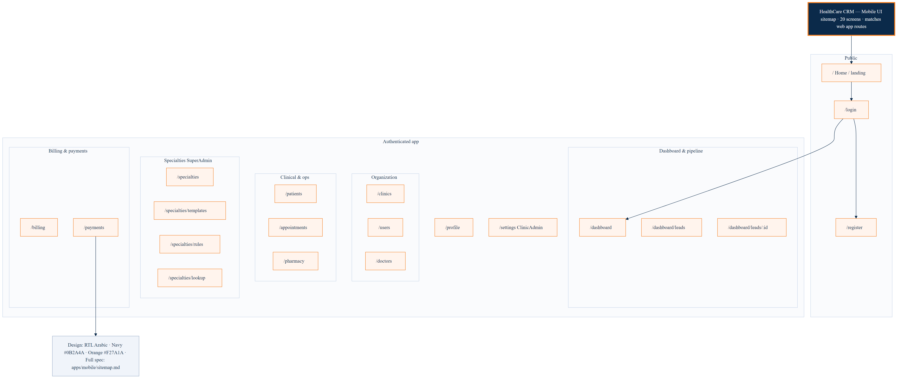
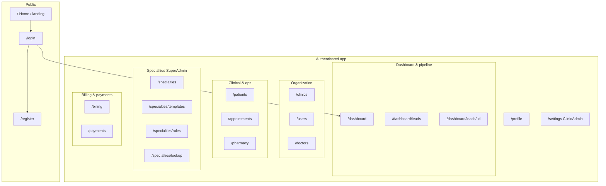

# HealthCare CRM Mobile — UI/UX site map & designer allocation (Flutter)

This file is the full UI/UX guide for the Flutter mobile app. The web source of truth is `apps/frontend` (`NAVIGATION_LINKS`, `route-access.ts`, App Router pages).

---

## What this document is for

This document is written for **UI/UX designers** who will design the **Flutter mobile app**. It lists **every main screen** that matches the existing **web app** in `apps/frontend`. You can copy it into **Figma** briefs and split the work between **four designers** without forgetting a flow.

**What we mean by “one screen”:** In this document, **one screen** usually means **one main page** (one path / URL on the website). Some pages are very big (for example **Patients**). For those pages, you will still add **more frames** in Figma (list, detail, filters, pop-ups). That is expected.

**Where the list comes from:** The real navigation and routes in the frontend code (`NAVIGATION_LINKS`, `route-access.ts`, and each `page.tsx` file).

---

## Simple glossary

| Word | Meaning in simple English |
|------|---------------------------|
| **Route / path** | The address of a page, for example `/login`. |
| **RTL** | **Right-to-left** layout. Arabic reads from right to left, so the layout mirrors compared to English (menus, back buttons, lists). |
| **Role** | The kind of user (for example clinic admin, super admin). Not everyone sees every menu item. |
| **Permission** | A rule like “this user may open patients.” The app may hide a whole screen if the user is not allowed. |
| **Hub screen** | A page that mainly **links** to other pages about the same topic (for example the Specialties home page). |
| **Coming soon** | On the website, some features still show a “coming soon” label. You can still **design** them for mobile if the team plans to ship them later. |

---

## User journey (step by step)

1. **First visit:** The user may open the **home / landing** page, then choose **log in** or **register**.
2. **After a successful login:** The user usually lands on the **dashboard** (summary and shortcuts).
3. **Day-to-day work:** The user opens **patients**, **appointments**, **pharmacy**, and other areas depending on their job.
4. **Some users** (for example **Super Admin**) also use **specialties** (templates, rules, lookup).
5. **Clinic admin** may open **settings** for their clinic.
6. **Profile** is for the **logged-in user’s own** account (not the same as “patients”).

**Language:** The web app is set up for **Arabic** and **RTL**. Mobile designs should follow **RTL** unless the product team adds another language later.

---

## Site map (diagram)

**High-resolution PNG for designers (slides, Figma, print):**  

Source files: [`docs/design/ui-sitemap-flowchart.png`](./docs/design/ui-sitemap-flowchart.png) (image), [`docs/design/ui-sitemap-flowchart.mmd`](./docs/design/ui-sitemap-flowchart.mmd) (Mermaid — edit and re-export). How to regenerate: [`docs/design/README.md`](./docs/design/README.md).

**Same diagram (Mermaid — editable in Markdown / GitHub):**

## Same map in plain text (if the diagram does not load)

- **Public:** Home → Login and Register  
- **After login:** Dashboard, Profile, and sometimes Settings  
- **Sales / pipeline:** List of leads → one screen for each lead’s details  
- **Organization:** Clinics, Users, Doctors  
- **Clinical work:** Patients, Appointments, Pharmacy  
- **Specialties (Super Admin):** Specialties home → Templates, Rules, Lookup  
- **Money:** Billing, Payments  

---

## All screens in one table (with simple descriptions)

Each row is **one main screen** to design. The **Path** column matches the web app route (the Flutter app will use the same idea with mobile routes).

| # | Path | What users do here (simple description) |
|---|------|------------------------------------------|
| 1 | `/` | **Home / landing** — first screen; often marketing text and a button to log in. |
| 2 | `/login` | **Sign in** — user enters identity and password; can link to “create account.” Show clear errors if login fails. |
| 3 | `/register` | **Create account** — user fills the fields your product needs; can link back to login. |
| 4 | `/profile` | **My profile** — the **current user** views or edits their own information. |
| 5 | `/settings` | **Clinic settings** — mainly for **Clinic Admin**. Other roles may not see this screen (hide it or show “not allowed”). |
| 6 | `/dashboard` | **Dashboard** — numbers, cards, and shortcuts to other areas; think about an **empty state** when there is no data yet. |
| 7 | `/dashboard/leads` | **Leads list** — list or table of possible customers; tapping one row opens the lead detail screen. |
| 8 | `/dashboard/leads/[id]` | **One lead** — full information for a single lead (view or edit, based on product rules). |
| 9 | `/clinics` | **Clinics** — manage clinic records (this product supports more than one clinic). |
| 10 | `/users` | **Users** — staff or system users; often includes roles and access. |
| 11 | `/doctors` | **Doctors** — doctor profiles connected to the clinic. |
| 12 | `/patients` | **Patients** — often the **largest** area: search, list, patient file, and related actions. Match the main flows from the web app. |
| 13 | `/appointments` | **Appointments** — booking, list, and details; may need **pop-ups** or **bottom sheets** (for example medical record). |
| 14 | `/pharmacy` | **Pharmacy** — medicines / pharmacy-related work for the clinic. |
| 15 | `/specialties` | **Specialties hub** — entry screen with links to templates, rules, and lookup (**Super Admin**). |
| 16 | `/specialties/templates` | **Templates** — manage specialty templates. |
| 17 | `/specialties/rules` | **Rules** — build or edit rules; can be complex, so use clear steps on small screens. |
| 18 | `/specialties/lookup` | **Lookup** — search or lookup tools for specialties. |
| 19 | `/billing` | **Billing** — invoices or billing overview (may still be “coming soon” on the website). |
| 20 | `/payments` | **Payments** — payment list or actions (may still be “coming soon” on the website). |

**Total: 20 main screens.**

---

## Quick list by area (same 20 screens, grouped)

| Area | Paths |
|------|--------|
| Public | `/`, `/login`, `/register` |
| Account & admin | `/profile`, `/settings` |
| Dashboard & leads | `/dashboard`, `/dashboard/leads`, `/dashboard/leads/[id]` |
| Organization | `/clinics`, `/users`, `/doctors` |
| Clinical | `/patients`, `/appointments`, `/pharmacy` |
| Specialties | `/specialties`, `/specialties/templates`, `/specialties/rules`, `/specialties/lookup` |
| Finance | `/billing`, `/payments` |

---

## Design rules (for the whole team)

- **RTL:** Mirror layouts for Arabic (alignment, icons, back affordances).
- **Roles:** When a screen is only for **Super Admin** or **Clinic Admin**, write a short note on the Figma frame so developers know.
- **Permissions:** Some menu items disappear for some users; show **hidden** or **alternative** states if the team asks for it.
- **Coming soon:** Leads, Billing, and Payments may show “coming soon” on the web; still design them if mobile will ship those features.
- **Touch:** Finger-friendly tap sizes; respect **safe areas** (notch, home indicator).
- **Brand:** Navy `#0B2A4A`, orange `#F27A1A`, logo `healthcare.jpeg` (see root `README.md`).

---

## Four designers — five screens each

Each designer gets **five main screens** so the workload is fair. **Designer 3** has the heaviest day-to-day screens. **Designer 4** has smaller screens but dense admin tools. The team can move **time** between people if one designer finishes early.

| Designer | Theme | Paths (5 screens) | What to prepare in Figma (examples) |
|----------|--------|---------------------|-------------------------------------|
| **Designer 1** — First steps & account | Welcome, sign-in, sign-up, personal account, clinic settings | `/`, `/login`, `/register`, `/profile`, `/settings` | Default view, **error** view (wrong password, server error), **loading** if needed. For **settings**, show what **Clinic Admin** sees; note what other roles should **not** see. |
| **Designer 2** — Overview & organization | Summary, sales pipeline, clinics, staff users | `/dashboard`, `/dashboard/leads`, `/dashboard/leads/[id]`, `/clinics`, `/users` | **Dashboard:** empty state when there is no data. **Leads:** list + **one** detail layout. **Clinics** and **Users:** list row + detail or edit pattern. |
| **Designer 3** — Care & daily work | Doctors, patients, appointments, pharmacy, specialties home | `/doctors`, `/patients`, `/appointments`, `/pharmacy`, `/specialties` | **Doctors:** list and detail. **Patients:** plan **several frames** (list, search, detail, important actions). **Appointments:** list or calendar + sheets. **Pharmacy:** main flows. **Specialties hub:** three clear buttons/links to Designer 4’s screens. |
| **Designer 4** — Specialties tools & money | Templates, rules, lookup, billing, payments | `/specialties/templates`, `/specialties/rules`, `/specialties/lookup`, `/billing`, `/payments` | Specialty screens: break complex tasks into **steps**. **Billing** and **Payments:** list or cards + empty state; optional “coming soon” style if the product keeps that label. |

---

## Extra work (not part of the 20 screens)

These items are shared. The team should agree who draws them.

| Item | Why it is useful | Common owner |
|------|------------------|--------------|
| **Splash screen** | Shown while the app starts | Designer 1 |
| **Onboarding slides** (optional) | Explains the app to new users | Designer 1 |
| **App shell** | Bottom navigation or drawer that wraps many screens | Designer 1 works with developers on one master layout |
| **Design system** | Reusable buttons, fields, cards, spacing | One **lead designer** or a short weekly team review |
| **Pop-ups / bottom sheets** | Confirmations, quick forms | The designer who owns the **main** screen (example: appointment extras → Designer 3) |

---

## When one path needs many Figma frames

Example: **`/patients`** is still **one assigned screen** for Designer 3, but in Figma you may draw:

- Patient list  
- Search open  
- Patient detail  
- Edit patient  
- Empty list  

Plan **extra time** for these frames; they still belong to the same path.

---

## Handoff checklist for developers

- Use clear Figma page names: **screen title + path** (example: `Patients — /patients`).
- On each main frame, add a short note: **RTL**, **role** (who can see it), and main **states** (default, error, empty).
- Share **spacing** and **component** names so Flutter can match design tokens when possible.
